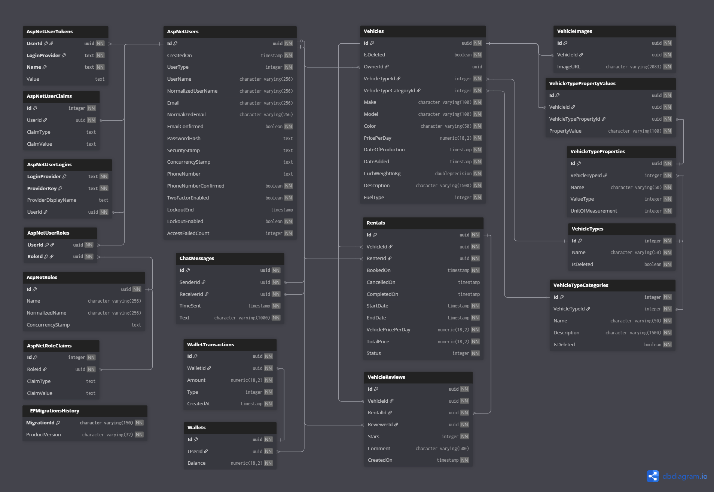
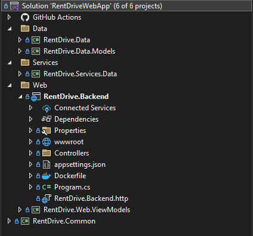
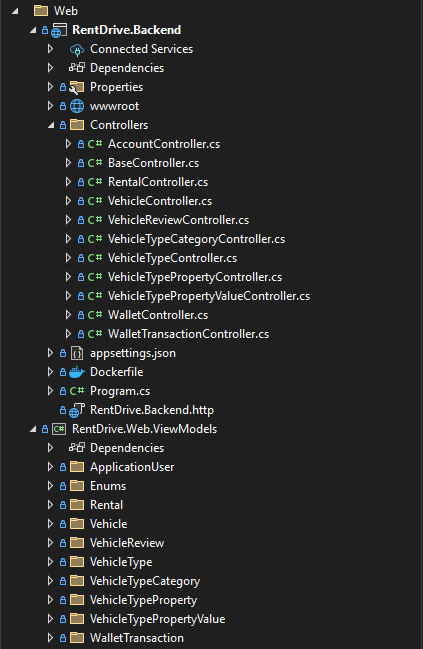
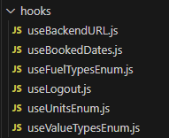

# RentDrive

<p align="center">
  
  &nbsp;&nbsp;&nbsp;&nbsp;
  
  &nbsp;&nbsp;&nbsp;&nbsp;
  <a href="https://rentdrive.eu"></a>
  &nbsp;&nbsp;&nbsp;&nbsp;
  
  &nbsp;&nbsp;&nbsp;&nbsp;
  
  &nbsp;&nbsp;&nbsp;&nbsp;
  
</p>

RentDrive is a vehicle rental web application where users can rent vehicles or list their own to earn profit. It supports a wide range of vehicles, with booking management and availability calendars to easily track rentals.  

This project is still under active development. 🚧

🌐 Live App: https://rentdrive.eu

The entire application is fully Dockerized and deployed on a Raspberry Pi 4B using Docker Compose and Watchtower, with a CI/CD pipeline via GitHub Actions for automatic build and deployment of updated images.


---

## ✨ Features  

### 🟢 Implemented
- **User Authentication** – Secure login & registration using ASP.NET Identity (cookie-based).  
- **Vehicle Management** – Add and manage vehicles with base properties (make, model, color, price per day, etc.).  
- **Dynamic Vehicle Fields** – Managers can create, edit, and delete:
  - Vehicle Types (Car, Motorcycle, Truck, etc.)  
  - Vehicle Categories (SUV, Sedan, Naked, Tour, etc.)  
  - Vehicle Properties (Engine Displacement, Door Count, Seat Count, etc.).  
- **Wallet System** – Users can top up wallets with card payments and use balance for rentals.  
- **Availability Calendar** – Check available vs. booked dates for each vehicle, up to 6 months ahead.  
- **Bookings** – Full-day rentals with status tracking (Active, Canceled, Completed).  
- **Search** – Quickly find vehicles by keyword (make, model, etc.).  
- **Chat:** Real-time chat between users with end-to-end message encryption.  

### 🚧 In Progress / Upcoming
- **Pickup & Return Logistics:** Manage rental logistics for real-world usage.  
- **Notifications:** Inform users about booking confirmations, cancellations, etc.  
- **Roles & Permissions:** Differentiate between managers, admins, and normal users.  
- **Live Chat Support:** Users can interact with company representatives in real-time.  
- **Admin Dashboard:** Admins can assign manager roles to users and monitor overall system activity.  
- **Discounts:** Apply promotional or seasonal discounts to rentals.

---

## 🚀 Getting Started  

> Since the project is already deployed at [rentdrive.eu](https://rentdrive.eu), local setup is optional.  
> If you want to run it yourself (for development or contribution):  

### Prerequisites  
- **Docker**  
- Or manually:  
  - Node.js  
  - .NET 9 SDK  
  - PostgreSQL

### Installation & Setup  

Option A: Docker (Recommended)
```bash
git clone https://github.com/Viktor-9904/RentDriveWebApp.git

cd RentDriveWebApp
docker-compose up --build -d
```

Option B: Run Client + Server Locally
```bash
# Run Backend
cd RentDrive.Backend
dotnet restore
dotnet run

# In a separate terminal, run Frontend
cd RentDrive.Frontend
npm install
npm run dev
```

---
## 👤 Test Users

The application comes with preloaded demo accounts you can use to explore the features:

- **Manager**  
  - Username: `jane.smith`  
  - Password: `Asd123`  

- **Regular Users**  
  - Username: `john.doe`  
  - Password: `Asd123`  
  - Username: `alex.miles`  
  - Password: `Asd123`
 
  ---

## 🛠 Technologies Used

- **Frontend:** ReactJS v19 (static CSS styling)  
- **Backend:** ASP.NET Core 9 Web API  
- **Database:** PostgreSQL (migrated from MS SQL Server)  
- **ORM:** Entity Framework Core  
- **Deployment:** Raspberry Pi 4B + Docker Compose + Watchtower  
- **CI/CD:** GitHub Actions (automatic build & deployment of updated Docker images)


---
 ## 📐 Project Structure and Architecture

 #### 📊 Database Schema
<p align="center">
  
</p>

---

### 🔧 Back-End Architecture
RentDrive uses a **classic monolithic 3-layer architecture**: Web, Service, and Data layers.

#### Overview of the Structure
<p align="center">
  
</p>

#### Server Structure

**Data Layer (`RentDrive.Data`)**  
- **Models:** Entities such as `Vehicles`, `VehicleTypes`, `VehicleTypeProperties`, `VehicleTypePropertyValues`, `VehicleTypeCategories`, `VehicleImages`, `VehicleReviews`, `Wallets`, `WalletTransactions`, `Rentals`.  
- **DbContext:** `RentDriveDbContext.cs` handles database access, relationships, and migrations.  
<p align="center">
  
</p>

**Services Layer (`RentDrive.Services.Data`)**  
- **Interfaces:** Service contracts for dependency injection.  
- **Implementations:** Business logic for vehicles, rentals, wallets, and bookings.  
<p align="center">
  
</p>

**Web Layer (`RentDrive.Backend`)**  
- **Controllers:** Handles HTTP requests; separated by functionality (e.g., VehicleController, RentalController).  
- **ViewModels:** Input models for validation and mapping to services.  
- **wwwroot:** Stores static files, including vehicle images uploaded by users.  
<p align="center">
  
</p>

**Common (`RentDrive.Common`)**  
- Global constants, enums, and helper utilities shared across layers.  

#### Features
Each feature (Vehicles, Rentals, Wallets, etc.) has its own directory containing:  

**Web:**  
- Controllers: Handles user requests.  
- ViewModels: Input/output data validation.  

**Services:**  
- Interfaces + Implementations: Business logic decoupled from web layer.  

**Data:**  
- Entity models, EF configurations, seeders for initial data.


---


### 🖥 Front-End Architecture
The frontend is built in **React v19** with static CSS. Components and logic are organized by feature and functionality.

#### Overview of the Front-End
<p align="center">
  
</p>

#### Components
- `components/` – JSX components grouped by feature (Vehicles, Rentals, Booking Calendar, etc.)  
- `contexts/` – Contexts for global state (AccountContext, etc.)  

<p align="center">
  
</p>

#### Pages
- `pages/` – Top-level page components that assemble multiple components for specific routes  

<p align="center">
  
</p>

#### Hooks
- `hooks/` – Custom hooks that encapsulate feature logic and API calls  

<p align="center">
  
</p>

<p align="center">
  
</p>

---

## 📄 License
This project is licensed under the MIT License.
